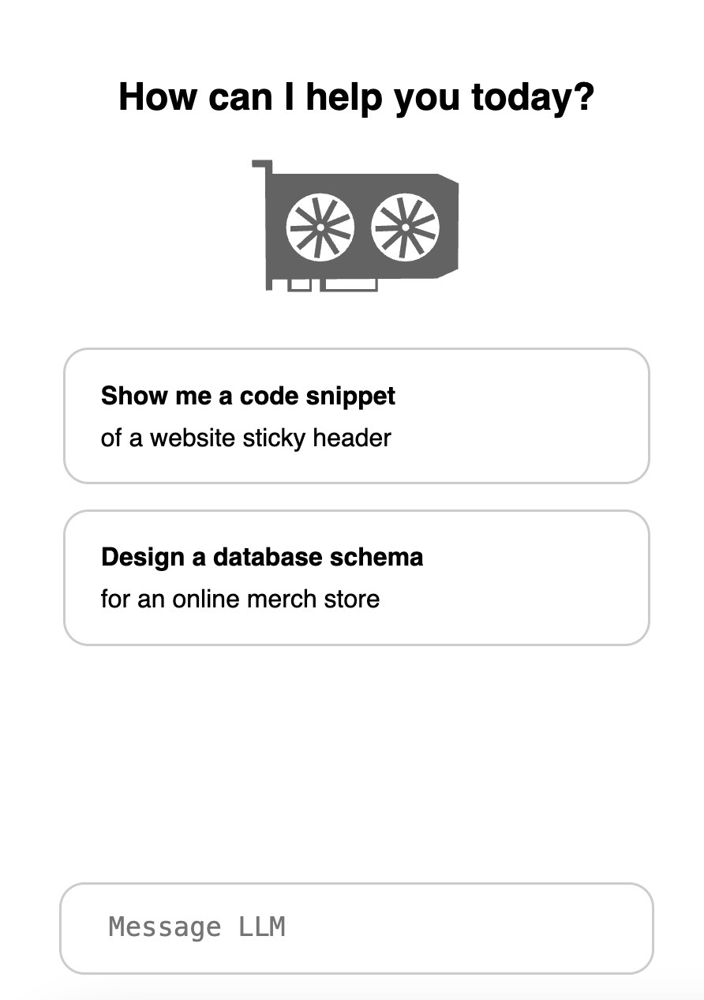

# LLM CHAT

LLM Chat is an interface for conversing with generic open source LLMs such as Zephyr7B and others.

Currently it uses *[EventStreams](https://gist.github.com/kezzico/29c23039d43f2a6790afccd451a3375a)* to deliver output from the model to the React application via Flask.



## Install

Start by [initializing the virtual environment](https://gist.github.com/kezzico/a16ebbee1573c3a177165e5c789fb141) in flask-app.

```
cd flask-app

python -m venv venv

source ./venv/bin/activate

pip install -r requirements.txt

deactivate
```

Next, initialize react-app.

```
cd react-app

npm install
```


## Run

Start the flask app by activating the virtual environment again

```
cd flask-app

source ./venv/bin/activate

python flaskapp.py
```

Next, from a separate shell, start the React app. 

```
cd react-app

npm run start
```

NPM should launch your browser automatically to localhost:3000

The React app has proxy settings to pass requests through to the flask app.
